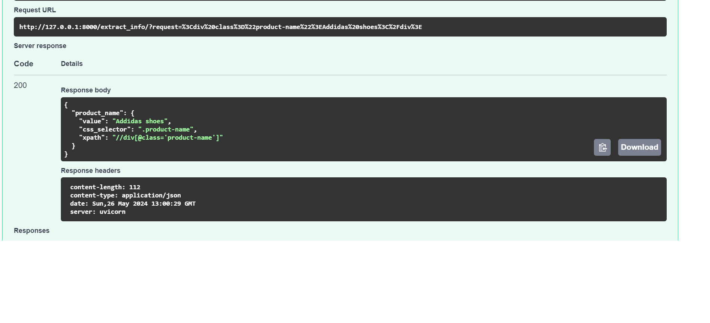

# HTML Parsing using LLM
## Choice of LLM and Rationale
### LLama3
The chosen language model for this project is LLama3. LLama3 was selected for its advanced capabilities in natural language understanding and generation. It excels in contextual comprehension, making it suitable for extracting meaningful information from complex HTML structures. Its efficiency and accuracy in handling various NLP tasks ensure reliable performance in transforming HTML content into structured JSON data.

## Details of the API's Design and Implementation
### API Design
The API is designed using FastAPI, a modern, fast (high-performance) web framework for building APIs with Python 3.7+ based on standard Python type hints. FastAPI was chosen due to its speed, automatic interactive API documentation, and easy-to-use interface.

### Implementation
The core function of the API, get_info, processes an HTML string to extract product-related attributes and returns the information in a structured JSON format. The implementation involves:

1. Splitting the HTML text into manageable chunks.
2. Initializing embeddings and a vector store.
3. Loading a QA chain with a specified query to extract relevant product information.
4. Converting the result into JSON format with CSS selectors and XPaths.

## Instructions for Setting Up and Testing the API
### Setting Up the Project
1. Create a Virtual Environment:

```python
python -m venv env
```
2. Activate the Virtual Environment:

On Windows:
```
.\env\Scripts\activate
```
On macOS/Linux:
```
source env/bin/activate
```
3. Install the Requirements:
```
pip install -r requirements.txt
```
4. Set Up Environment Variables:

- Create a .env file in the project root directory.
- Add the following line with your GROQ API key:
```
GROQ_API_KEY=your_groq_api_key

```
5. Run the FastAPI Application:

```
uvicorn main:app --reload
```

## Examples of Input HTML Blocks and the Corresponding JSON Output
Example 1: Single Element (This is test in the swagger UI)
#### Input HTML
```
<div class="product-name">Addidas shoes</div>
```
#### Output JSON
```
{
    "product_name": {
        "value": "Addidas shoes",
        "css_selector": ".product-name",
        "xpath": "//div[@class='product-name']"
    }
}
```

Example 2: Multiple Elements (This is done in the jupyter notebooks.)
#### Input HTML
```
<div class="product-name">Addidas shoes</div>
<span class="product-price">$100.99</span>
<div class="product-description">This is a Addidas shoes.</div>

```

#### Output JSON
```
{
    "product_name": {
        "value": "Addidas shoes",
        "css_selector": ".product-name",
        "xpath": "//div[@class='product-name']"
    },
    "price": {
        "value": "$100.99",
        "css_selector": ".product-price",
        "xpath": "//span[@class='product-price']"
    },
    "description": {
        "value": "This is a Addidas shoes.",
        "css_selector": ".product-description",
        "xpath": "//div[@class='product-description']"
    },
    "image_url": {
        "value": "sample-product.jpg",
        "css_selector": ".product-image",
        "xpath": "//img[@class='product-image']/@src"
    }
}
```


